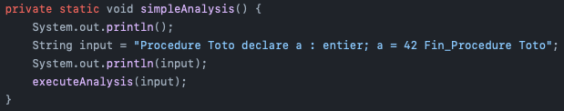

# Projet Analyseur lexical et syntaxique

## Concept
Il fallait développer un programme pour implémenter notre propre analyseur lexical et syntaxique d'un "langage de programmation" très rudimentaire.

Le langage contenait les blocs suivants: 
- Début de procédure (Procedure IDENTIFIER)
- Bloc Declarations
- Bloc Affectations
- Fin de procédure (Fin_Procedure)

## Exemple de programme

### Analyse simple

## Technologies
- Je me suis inspiré de la série d'articles suivants pour baser mes analyseurs: "https://lisperator.net/pltut/parser/"
- Java
